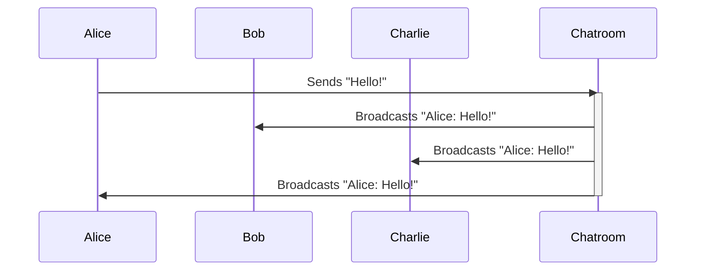
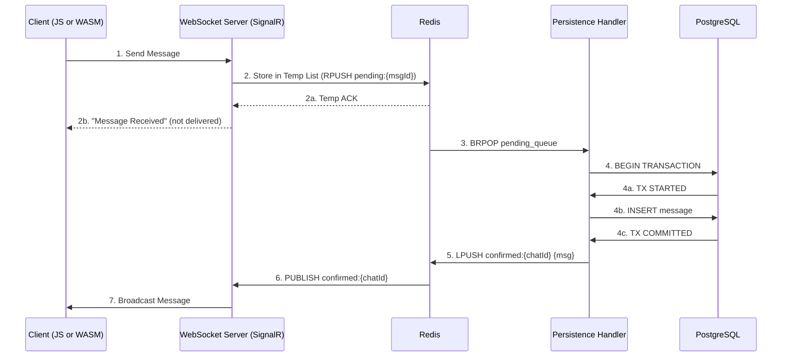

## What is Akka.NET?

[Akka.NET](https://getakka.net/) is a C# and F# implementation of [the actor model](https://petabridge.com/blog/akkadotnet-what-is-an-actor/), a very old computer science concept aimed at simplifying concurrent and parallel programs.

<iframe width="560" height="315" src="https://www.youtube.com/embed/2Orp1ohI61o" title="Why Learn Akka.NET?" frameborder="0" allow="accelerometer; autoplay; clipboard-write; encrypted-media; gyroscope; picture-in-picture; web-share" referrerpolicy="strict-origin-when-cross-origin" allowfullscreen></iframe>
Actors are designed primarily to simplify concurrent programming - _stateful_ concurrent programming in particular by doing the following:

1. All state is housed inside actor class instances;
2. Actors can only be interacted with through message passing; and
3. Messages are processed in sequential order, one message at a time.

This has the important side effect of making _all state managed by actors automatically thread-safe_ and making actor invocation order predictable (actors process messages in the order that they were sent to them.) No more `lock`s, semaphores, critical regions, and so on.

## License

Before we get into the particulars of Akka.NET, a pertinent question:

> Can I use Akka.NET in commercial software?

The answer is a resounding “yes!” Akka.NET is licensed under [Apache 2.0](https://www.tldrlegal.com/license/apache-license-2-0-apache-2-0), a permissive and commercially-friendly FOSS software license.

## Use Cases for Actors

There are two different strata of use cases for actors:

- **Critical business cases** - applications that require predictably low latency, high availability, decentralization, and so on.
- **Acute technical cases** - dispatching completed background work to the foreground UI, task scheduling + ordering, flow control, throttling, caching, and more.

Akka.NET is extremely versatile - it can scale up to support large distributed systems in the “critical business case” category or it can be embedded into ASP.NET Core / console / native UI applications to perform acute technical work.

You can run Akka.NET in the background inside most .NET applications; you can run Akka.Cluster with tens, hundreds, and even thousands of Akka.NET processes all working cooperatively together; or you can do a mix of both. Akka.NET doesn’t have strong opinions about where it should be used.

### Industries and Use Cases

In case you’re wondering about business use cases for Akka.NET, here’s some examples of where Akka.NET has been used successfully at large scale:

1. **Banking**: online transaction processing, real-time fraud detection, CRM, asset line management, ForEx, and more.
2. **Insurance**: real-time quote generation, fraud detection, payments, customer contact campaigns, and more.
3. **Finance**: portfolio management, trade capture systems, real-time trading, risk indicators, simulations and forecasting, live dashboards, and more.
4. **Sports Betting**: odds-making, market-making, transaction processing, loyalty rewards, and more.
5. **E-Commerce**: real-time pricing, graph search, inventory management, fulfillment systems, and more.
6. **Software-as-a-Service**: real-time collaboration, dashboards, systems integration, workflows, and more.
7. **Video games**: multi-player, game lobbies, chat, NPC activity, and more.
8. **Manufacturing**: Industry 3.0 / 4.0, SCADA, process line control systems, real-time scheduling, simulations, safety monitoring, robot automation, and more.
9. **Energy**: meter data management, simulations, safety monitoring, field production monitoring, and more.
10. **Fleet and Vehicle Management**: mission / flight planning, cargo tracking, scheduling, autonomous vehicles, and more.

This isn’t an exhaustive list by any means, but it should answer the question “is Akka.NET suitable for _big_ applications?”

## What Does Akka.NET Do?

The basic gist of the actor model is that all of your business objects are represented as actors:

```cs
public class BasicActor : UntypedActor {
    // can declare properties / fields, like any old class

    protected override void OnReceive(object message) {
        // handle different message classes
    }
}
```

What’s so special about actors?

- **Actors communicate asynchronously via message-passing** - we don’t invoke methods on them, we send them messages instead;
- **Actors process messages one-at-a-time in First-In First-Out (FIFO) order** - this means that any state inside an actor is automatically thread-safe;
- **Actors are reactive** - actors don’t utilize any CPU resources unless they have messages that need to be processed. Otherwise, they’ll just wait for work to be sent to them.
- **Actors are cheap and efficient** - capable of processing small bursts of messages with no context switching, a single bare-bones actor can process 7-8 million messages per second. And by default, actors use ~1kb of memory or less.
- **Actors have a process-like lifecycle** - they can restart when they crash with an unhandled exception; they can spawn child actors; and parents have the ability to supervise their children in order to decide how to handle failures.

Given the above, this makes it _much easier_ to reason about concurrent programming than the alternatives: using `lock` and other synchronization mechanisms.

## Actors Simplify Concurrent Programming

How do actors simplify concurrent programming? Let’s consider an example: processing live messages in a chatroom.
### Example: Chatroom



When user `Alice` sends a message to the chatroom, we have to broadcast that message back to every other user who is currently connected, typically via a websocket connection like SignalR.

Let’s set aside, for a moment, the HTTP / WebSocket / client-side technology we could need to deliver this experience to users over a web-browser - let’s focus on the back-end technology since that’s where Akka.NET has a part to play.

If you had a chat room with the following requirements:

1. All messages must be persisted;
2. All users must be shown the same messages in the same order;
3. New users must be synchronized to the latest `n` chat messages, so they can catch up with current users; and
4. All users must see new chat messages within 1 second of them being published.

You would need infrastructure that looks akin to this:


Nothing wrong with that stack, but that’s _a lot_ of systems infrastructure to have to write instead of doing… Actual application programming.

### Chatroom: Akka.NET

Let’s compare this to an Akka.NET equivalent.

> N.B. This code sample is intentionally kept simple. We’ll get into best practices later in _Bootcamp_.

```cs
public sealed class ChatRoomActor : UntypedActor {

    /* Message definitions - don't have to be a nested class, but doing this for brevity */
    public sealed record UserJoined(string UserId, string ChatId IActorRef ConnectionActor);
    public sealed record UserLeft(string UserId, string ChatId, IActorRef ConnectionActor);
    public sealed record Say(string UserId, string ChatId, string Message, DateTimeOffset Timestamp);

    /* ChatRoomActor state */
    public string ChatId { get; }
    public Dictionary<IActorRef, string> Users {get;} = new();
    public CircularBuffer<Say> Messages { get; }
    public int MaxRetainedMessages; { get; }

    public ChatRoomActor(string chatId, int maxRetainedMessages = 100){
        ChatId = chatId;
        MaxRetainedMessages = 100;
        Messages = new CircularBuffer<Say>(MaxRetainedMessages);
    }

    protected override OnReceive(object message){
        switch(message){
            case Say say:
            {
                Messages.Enqueue(say);
                foreach(var u in Users){
                    // publish msg to user
                    u.Key.Tell(say);
                }
                break;
            }
            case UserJoined join:
            {
                if(!Users.TryGetValue(join.ConnectionActor, out var userId)){
                    // sync user
                    foreach(var m in Messages){
                        join.ConnectionActor.Tell(m);
                    }

                    Users[join.ConnectionActor] = join.UserId;
                }

                // automatically un-sub disconnected users
                Context.WatchWith(join.ConnectionActor, 
                    new UserLeft(join.UserId, join.ChatId, join.ConnectionActor));
                break;
            }
            case UserLeft left:
            {
                // stop publishing to this user
                Users.Remove(left.ConnectionActor);
                break;
            }
            default:
                Unhandled(message); // logs a warning
                break;
        }
    }
}
```

This `ChatRoomActor` implementation does just about everything the sample above does sans persistence (which [Akka.Persistence](https://getakka.net/articles/persistence/architecture.html) will enable later):

1. The actor’s mailbox forces all messages to be queued in FIFO order for all users in the chatroom globally;
2. The actor’s state caches all of the current users AND their WebSocket actors using a simple `Dictionary<TKey, TValue>`;
3. The actor’s state uses a `CircularBuffer<T>`[^1], basically a fixed length queue where older values get gradually overwritten, to buffer the last `n` delivered messages in-memory;
4. Because the actor only processes messages one at a time, we automatically guarantee that all users will receive the exact same message order even if they’re syncing / pushing messages.

We intentionally didn’t show what the `ConnectionActor`’s implementation looks like, because that’s also part of the beauty of Akka.NET: to build the `ChatRoomActor` _you don’t need to know_! You only need to know what messages to send the actor and what responses it might send back.

And therein lies the power of Akka.NET - which we’re going to begin exploring in the next lesson: “[Our First Akka.NET Application](https://petabridge.com/bootcamp/lessons/unit-0/first-akkadotnet-app/).”

### Further Reading

More articles, blog posts, and videos relevant to this lesson:

1. [How to Start Learning Actor-Based Programming](https://petabridge.com/blog/begin-learning-actor-based-design/)
2. [Akka.NET: What is an Actor?](https://petabridge.com/blog/akkadotnet-what-is-an-actor/)
3. [When and How to Use the Actor Model An Introduction to Akka NET Actors](https://www.youtube.com/watch?v=0KnIMDoJpZs)

---

[^1]: If you want a `CircularBuffer<T>` implementation, try [Petabridge.Collections](https://github.com/petabridge/Petabridge.Collections) [↩](https://petabridge.com/bootcamp/lessons/unit-0/why-akkadotnet/#fnref:1)

- Previous Lesson: [[Akka.NET Bootcamp Lesson Overview]]
- Next Lesson: [[2 Our First Akka.NET Application]]