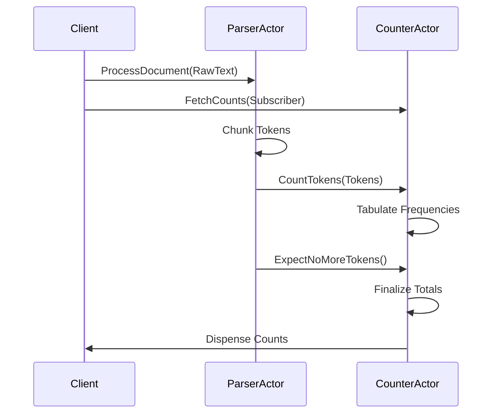

## Actor-to-Actor Messaging

We have our basic `AkkaWordCounter` project from the previous lesson and we’re going to modify it to do some more interesting things.

In this particular lesson, we’re going to focus on leveraging actor-to-actor messaging to build something that looks a lot closer to a real-world Akka.NET application.

<iframe width="560" height="315" src="https://www.youtube.com/embed/_amd2owJQI0" title="Tutorial: Creating Your SECOND Akka.NET Application (Bootcamp 2.0 Unit-0 - Lesson 2 of 2)" frameborder="0" allow="accelerometer; autoplay; clipboard-write; encrypted-media; gyroscope; picture-in-picture; web-share" referrerpolicy="strict-origin-when-cross-origin" allowfullscreen></iframe>

### Goal: Analyze Word Count Frequencies

The goal of this application is to count the frequencies of words as they appear in bodies of text. Therefore, we’re going to need a few components in order to make this happen:

1. An actor to store and process the actual frequencies;
2. An actor to retrieve and parse a document containing text; and
3. A messaging protocol designed to propagate information between these actors and display the final results when completed.

In our [live Akka.NET training courses](https://petabridge.com/training) we also recommend starting with the design of your messaging protocols, so that’s what we’re going to do first.

### Execution Flow

What would implementing this application with actors look like, possibly? We should imagine this _first_ before we start writing code.



A really important and powerful detail about this messaging protocol we’ve designed: we are going to send our `CounterQueries.FetchCounts` message to the `CounterActor` before it processes any data and we will still get the correct result back.

This is a massive difference between actors and regular procedural or object-oriented code: we can defer replying to messages until we’re good and ready in the actor model; with a function call _we must return something right now_. That thing we return could be a promise to fulfill the request later, i.e. a `Task<T>`, but as we’ll see throughout bootcamp the actor model is much, much, much more flexible by comparison.

Otherwise, the messaging protocol is simple:

1. We have the `ParserActor` start chunking a document into `CountTokens` messages;
2. The `ParserActor` streams the `CountTokens` messages to the `CounterActor`;
3. Once the `ParserActor` reaches the end of the file, we send a `ExpectNoMoreTokens` message to the `CounterActor`; and
4. The `CounterActor` responds to anyone who has sent it a `FetchCounts` message with the final tabluations of all word frequencies.

That’s pretty slick - let’s implement it!

## Building Messaging Protocols

In the subsequent units of Akka.NET Bootcamp we’ll be building more sophisticated messaging protocols, but for now we’re going to stick with a fairly simple one. Simple and _well-organized_.

```cs
public static class DocumentCommands {
    public sealed record ProcessDocument(string RawText);
}

// Counter Inputs
public static class CounterCommands {
    public sealed record CountTokens(IReadOnlyList<string> Tokens);

    // parser reached the end of the document
    public sealed record ExpectNoMoreTokens();
}

// Counter Queries
public static class CounterQueries {
    // Send this actor a notification once counting is complete
    public sealed record FetchCounts(IActorRef Subscriber);
}
```

Copy and paste this code or type it into a new file, `Messages.cs`, inside your `AkkaWordCounter` project.

### Messages as Effects Systems

We’re following a fairly common message organization pattern in Akka.NET: defining messages as effects systems.

1. **Commands** are instructions for actors that they need to _do_ something. Commands are often validated before they’re processed. When a command is successfully processed it will often produce an effect, represented as an “event” message typically.
2. **Events** are often the output of commands - they are matters of fact: things that have already happened and need to be incorporated into the state model. Our `AkkaWordCounter` application doesn’t use any events at the moment.
3. **Queries** are read-only instructions to actors to either fetch the value of some state now _or_ to notify us about state changes when / if / as they happen.

There are other types of messages that are commonly used too, such as an acknowledgement messages indicating that a command has been accepted or rejected for processing.

This manner of thinking about message definitions is advantageous because it makes it really easy to understand which messages are potentially dangerous (commands) and which ones are not (queries and events.)

### Organizing Messages by Entity Type

The first method for organizing messages is by their role in the effects system we described earlier; we combine that method with a second one: grouping messages by the type of entity they act against.

In our case we know we’re going to have two different types of “things” in our application, each represented by its own actor type:

1. A document parser actor and
2. A counter actor.

Therefore, we’re going to group messages like so:

1. **Commands: Document** == `static class DocumentCommands`
2. **Commands: Counter** == `static class CounterCommands`
3. **Queries: Counter** == `static class CounterQueries`

We’re nesting all of our individual message definitions inside a `static class` with a corresponding name just to make it really, really, really clear what type of entity this message is intended for AND what sorts of effects this message might have. That’s why we’re classifying things this way - and it’s good habit to get into from the beginning.

### Message Types Should Always Be Immutable

Unless you explicitly configure the `Props` to do otherwise, every time you call `ActorOf` in Akka.NET you’re going to spawn a local `IActorRef` that runs inside the current process.

This means that if you broadcast the message to multiple actors those actors will have access to the same instance of that message in-memory. Therefore, if your messages are mutable (i.e. public setters, uses a mutable collection as a public property, etc) then you run the risk of creating unpredictable side-effects between actors.

The easiest way to avoid this problem is to do the following:

1. Always declare your messages as `record` types when working in C# and
2. Never use a mutable collection - always use either read-only collections or System.Collections.Immutable.

## Actor Implementations

First thing we are going to do is implement the `CounterActor`. Please create a new file called `CounterActor.cs` and then type out (or copy-and-paste) the following:

```cs
using static CounterQueries;
using static CounterCommands; // make message handlers less verbose

public sealed class CounterActor : UntypedActor {
    private readonly ILoggingAdapter _log = Context.GetLogger();
    private readonly Dictionary<string, int> _tokenCounts = new();
    private bool _doneCounting = false;

    // for actors who sent us a FetchCounts before we were done counting
    private readonly HashSet<IActorRef> _subscribers = new();

    protected override void OnReceive(object message) {
        switch(message){
            case CountTokens tokens:
            {
                foreach(var t in tokens.Tokens){
                    if(!_tokenCounts.TryAdd(t, 1)){
                        _tokenCounts[t] += 1;
                    }
                }
                break;
            }
            case ExpectNoMoreTokens:
            {
                _doneCounting = true;

                _log.Info(
                    "Completed counting tokens - found [{0}] unique tokens", 
                    _tokenCounts.Count);

                // ensure the output is immutable
                // cheaper to do this once at the end versus every time we count
                var totals = _tokenCounts.ToImmutableDictionary();
                foreach(var s in _subscribers)
                {
                    s.Tell(totals);
                }

                // don't need to track subscribers anymore
                _subscribers.Clear();
                break;
            }
            case FetchCounts fetchCounts when _doneCounting:
            {
                // instantly reply with the results
                fetchCounts.Subscriber.Tell(_tokenCounts.ToImmutableDictionary());
                break;
            }
            case FetchCounts fetch:
            {
                _subscribers.Add(fetch.Subscriber);
                break;
            }
            default:
                Unhandled(message);
                break;
        }
    }
}
```

Next, we’re going to implement our `ParserActor` - create a new file called `ParserActor.cs` and type in the following code:

```cs
using static DocumentCommands;
using static CounterCommands; // make message handlers less verbose

public sealed class ParserActor : UntypedActor {
    private readonly ILoggingAdapter _log = Context.GetLogger();
    private readonly IActorRef _countingActor;

    public ParserActor(IActorRef countingActor)
    {
        _countingActor = countingActor;
    }

    private const int TokenBatchSize = 10;

    protected override void OnReceive(object message){
        switch(message){
            case ProcessDocument process:
            {
                // chunk tokens into buckets of 10
                foreach(var tokenBatch in process.RawText.Split(" ").Chunk(TokenBatchSize)){
                    _countingActor.Tell(new CountTokens(tokenBatch));
                }

                // we are finished
                _countingActor.Tell(new ExpectNoMoreTokens());
                break;
            }
            default:
                Unhandled(message);
                break;
        }
    }
}
```

This is all pretty straightforward based on the description of our messages and our execution flow.

Now with both of these actors implements, let’s put it all together.

### Starting the Actors

We need to modify `Program.cs` to start both the `CounterActor` and the `ParserActor`.

Type out this code so it executes just before we call `.Terminate` on the `ActorSystem`.

```cs
var counterActor = myActorSystem.ActorOf(Props.Create<CounterActor>(), 
    "CounterActor");
var parserActor = myActorSystem.ActorOf(Props.Create(() => new ParserActor(counterActor)), 
    "ParserActor");

Task<IDictionary<string, int>> completionPromise = counterActor
    .Ask<IDictionary<string, int>>(@ref => new CounterQueries.FetchCounts(@ref), null, 
    CancellationToken.None);

parserActor.Tell(new DocumentCommands.ProcessDocument(
    """
        This is a test of the Akka.NET Word Counter.
        I would go
        """
    ));

IDictionary<string, int> counts = await completionPromise;
foreach(var kvp in counts)
{
    // going to use string interpolation here because we don't care about perf
    myActorSystem.Log.Info($"{kvp.Key}: {kvp.Value} instances");
}


/* THIS CODE WAS ALREADY HERE BEFORE */
await myActorSystem.Terminate();
```

One bit of funny-looking code is the overload of `Ask<T>` that we’re using - remember earlier how we said that `Ask<T>` creates a temporary, one-time use `IActorRef` and uses replies to that `IActorRef` to complete the `Task<T>`? What this overload is doing is it allows us to _explicitly capture_ that temporary actor reference and pass it into our `CounterQueries.FetchCounts` message as an argument.

Otherwise, this code does exactly what we planned in our diagram. Let’s run it and see the results:

```powershell
[INFO][{DateTime}][Thread 0011][akka://LocalSystem/user/CounterActor] Completed counting tokens - found [11] unique tokens
[INFO][{DateTime}][Thread 0011][ActorSystem(LocalSystem)] the: 1 instances
[INFO][{DateTime}][Thread 0011][ActorSystem(LocalSystem)] of: 1 instances
[INFO][{DateTime}][Thread 0011][ActorSystem(LocalSystem)] Counter.
I: 1 instances
[INFO][{DateTime}][Thread 0011][ActorSystem(LocalSystem)] Word: 1 instances
[INFO][{DateTime}][Thread 0011][ActorSystem(LocalSystem)] is: 1 instances
[INFO][{DateTime}][Thread 0011][ActorSystem(LocalSystem)] test: 1 instances
[INFO][{DateTime}][Thread 0011][ActorSystem(LocalSystem)] Akka.NET: 1 instances
[INFO][{DateTime}][Thread 0011][ActorSystem(LocalSystem)] go: 1 instances
[INFO][{DateTime}][Thread 0011][ActorSystem(LocalSystem)] This: 1 instances
[INFO][{DateTime}][Thread 0011][ActorSystem(LocalSystem)] a: 1 instances
[INFO][{DateTime}][Thread 0011][ActorSystem(LocalSystem)] would: 1 instances
```

Looks good! The text isn’t super-interesting yet, but we’re headed in the right direction.

## Wrapping Up

So that’ll do for Unit 0! This covers the very basics of Akka.NET and should be enough to get you started designing simple actor applications.

In the next unit, Unit 1 - we’re going to take our Akka.NET education even further and start learning how to integrate Akka.NET with Microsoft.Extensions, create child actors, work with `await`, create scheduled messages, and much more.

### Further Reading

1. [Akka.NET Application Design: Don’t Create Bespoke Frameworks; Use Repeatable Patterns](https://www.youtube.com/watch?v=X1Tg4R2JFMQ) - explains the “effects system” paradigm for message definitions in more detail, but this also gets covered more in Lesson 1.

- Previous Lesson: [[2 Our First Akka.NET Application]]
- Next Lesson: [[1 Using Akka.Templates to Create New Projects]]