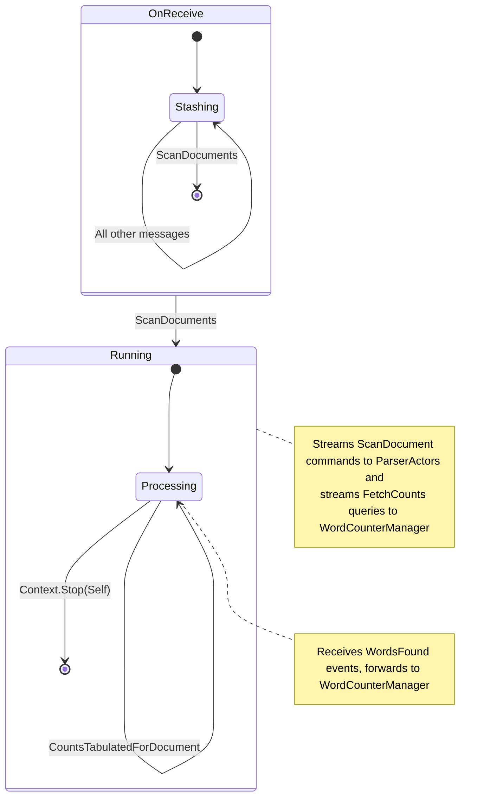

The final lesson of Unit 1 of Akka.NET Bootcamp! In this lesson we’re going to write a small “saga” actor, the `WordCountJobActor`, and use it to complete `AkkaWordCounter2`.

<iframe width="560" height="315" src="https://www.youtube.com/embed/Amm7jmTifX8" title="Tutorial: Creating Professional, Local Akka.NET Applications (Bootcamp 2.0 - Unit 1)" frameborder="0" allow="accelerometer; autoplay; clipboard-write; encrypted-media; gyroscope; picture-in-picture; web-share" referrerpolicy="strict-origin-when-cross-origin" allowfullscreen></iframe>
_Starts at the appropriate timestamp for this lesson_

## Sagas and Actors

Actors are a great fit for modeling sagas - and if you’re not sure what a saga is, it’s basically a term invented by message queue and cloud vendors to turn finite state machines into purchaseable products.

Ok, less cynically: sagas are _usually_ focused on distributed systems-type activity and ensuring that work is done in an orchestrated / coordinated fashion between them. Sagas are a type of finite state machine.

In our case the “distributed services” our saga is coordinating between two sets of independent actors: the `WordCounterManager` (and its children) and the `ParserActor`s. The `WordCountJobActor` is our implementation of this saga.

### Workflow and Design

When it comes to modeling stateful actor behavior, such as the `WordCountJobActor`’s, there are two schools of behavior:

1. **Finite streams** - entities that have well-defined beginnings and ends and
2. **Infinite streams** - entities that don’t have well-defined beginnings or ends[^1].

Our `WordCountJobActor` is a finite stream:

1. We begin by sending the `DocumentCommands.ScanDocuments(IReadOnlyList<AbsoluteUri> DocumentIds)` message to the `WordCountJobActor` - which kicks off all of the `ParserActor` and `WordCounterManager` activity.
2. We finish by returning the `DocumentEvents.CountsTabulatedForDocuments` back to all subscribers who sent us a `DocumentQueries.SubscribeToAllCounts` message.

Let’s illustrate how the `WordCountJobActor` is going to operate:


1. Once we receive the `DocumentCommands.ScanDocuments` message, we’re going to feed all of those `AbsoluteUri`s to the `ParserActor`s to begin their scans and we’ll send a `DocumentQueries.FetchCounts` message for each document to the `WordCounterManager` so it’ll send us a notification back once each document has been fully tabulated.
2. The `ParserActor`s are going to stream `DocumentEvents.FoundWords` messages back to us, which we’re going to forward to the `WordCounterManager` for tabulation.
3. While all of this is happening we may or may not receive 1 or more `DocumentQueries.SubscribeToAllCounts` message. Any actor who sends us this message will be added to our list of subscribers and will receive a `DocumentEvents.CountsTabulatedForDocuments` with our completed output once we’re finished.
4. As `ParserActor`s reach the end of their documents, we receive `DocumentEvents.EndOfDocumentReached` - which we will also forward to the `WordCounterManager`.
5. Once each individual `DocumentWordCounter` actor completes its tabulation it will send us a `DocumentEvents.CountsTabulatedForDocument` event in response, which we will save and incorporate into our totals.
6. After we’ve received all `DocumentEvents.CountsTabulatedForDocument` for all document ids, we are done. We will merge all of the counts together; deliver it to our subscribers; and shut ourselves down.

_None of this code is novel or new_ - these are all of the actors interactions we have both designed and tested in previous lessons. We’re just putting them all together.

### Implementing Prerequisites

Before we write the `WordCountJobActor` we need to add one small convenience method for merging all of the outputs at the end.

Inside `AkkaWordCounter2.App` please create a new file called `CollectionUtilities.cs` and then type in the following:

```cs
using System.Collections.Immutable;

namespace AkkaWordCounter2.App;

public static class CollectionUtilities
{
    public static IImmutableDictionary<string, int> MergeWordCounts(IEnumerable<IDictionary<string, int>> counts)
    {
        var mergedCounts = counts.Aggregate(ImmutableDictionary<string, int>.Empty,
            (acc, next) =>
            {
                foreach (var (word, count) in next)
                {
                    acc = acc.SetItem(word, acc.GetValueOrDefault(word, 0) + count);
                }

                return acc;
            });
        return mergedCounts;
    }
}
```

This is just a bit of LINQ to make it easier to aggregate all of the `DocumentEvents.CountsTabulatedForDocument` outputs at the end.

## Coding the `WordCountJobActor`

Please create a new file inside `AkkaWordCounter2.App/Actors` called `WordCountJobActor.cs` and type in the following:

```cs
using System.Collections.Immutable;
using Akka.Hosting;
using static AkkaWordCounter2.App.DocumentCommands;
using static AkkaWordCounter2.App.DocumentQueries;
using static AkkaWordCounter2.App.CollectionUtilities;

namespace AkkaWordCounter2.App.Actors;

/// <summary>
/// Responsible for processing a batch of documents.
/// </summary>
public sealed class WordCountJobActor : UntypedActor, IWithStash, IWithTimers
{
    private readonly ILoggingAdapter _log = Context.GetLogger();
    private readonly IRequiredActor<WordCounterManager> _wordCounterManager;
    private readonly IRequiredActor<ParserActor> _parserActor;
    
    public IStash Stash { get; set; } = null!;
    public ITimerScheduler Timers { get; set; } = null!;
    
    private readonly HashSet<IActorRef> _subscribers = new();
    private readonly Dictionary<AbsoluteUri, ProcessingStatus> _documentsToProcess = new();
    private readonly Dictionary<AbsoluteUri, ImmutableDictionary<string, int>> _wordCounts = new();
    
    public enum ProcessingStatus
    {
        Processing = 0,
        Completed = 1,
        FailedError = 2,
        FailedTimeout = 3
    }

    public sealed class JobTimeout
    {
        public static readonly JobTimeout Instance = new();
        private JobTimeout(){ }
    }
    
    public WordCountJobActor(
        IRequiredActor<WordCounterManager> wordCounterManager,
        IRequiredActor<ParserActor> parserActor)
    {
        _wordCounterManager = wordCounterManager;
        _parserActor = parserActor;
    }

    protected override void OnReceive(object message)
    {
        switch (message)
        {
            case ScanDocuments scan:
                _log.Info("Received scan request for {0}", scan.DocumentIds.Count);
                foreach (var document in scan.DocumentIds)
                {
                    _documentsToProcess[document] = ProcessingStatus.Processing;

                    // begin processing
                    _parserActor.ActorRef.Tell(new ScanDocument(document));

                    // get back to us once processing is completed
                    _wordCounterManager.ActorRef.Tell(new FetchCounts(document));
                }

                Become(Running);
                Timers.StartSingleTimer("job-timeout", JobTimeout.Instance, TimeSpan.FromSeconds(30));
                Stash.UnstashAll();
                break;
            default:
            {
                // buffer any other messages until the job starts
                Stash.Stash();
                break;
            }
        }
    }

    private void Running(object message)
    {
        switch (message)
        {
            case DocumentEvents.WordsFound found:
                _wordCounterManager.ActorRef.Forward(found);
                break;
            case DocumentEvents.EndOfDocumentReached eof:
                _wordCounterManager.ActorRef.Forward(eof);
                break;
            case DocumentEvents.CountsTabulatedForDocument counts:
                _log.Info("Received word counts for {0}", counts.DocumentId);
                _wordCounts[counts.DocumentId] = counts.WordFrequencies;
                _documentsToProcess[counts.DocumentId] = ProcessingStatus.Completed;
                HandleJobCompletedMaybe();
                break;
            case DocumentEvents.DocumentScanFailed failed:
                _log.Error("Document scan failed for {0}: {1}", failed.DocumentId, failed.Reason);
                _documentsToProcess[failed.DocumentId] = ProcessingStatus.FailedError;
                HandleJobCompletedMaybe();
                break;
            case JobTimeout _:
                _log.Error("Job timed out");
                
                // Set all documents that haven't been processed yet to timed out
                foreach (var (document, status) in _documentsToProcess)
                {
                    if (status == ProcessingStatus.Processing)
                    {
                        _documentsToProcess[document] = ProcessingStatus.FailedTimeout;
                    }
                }
                
                HandleJobCompletedMaybe(true);
                break;
            case SubscribeToAllCounts:
                _subscribers.Add(Sender);
                break;
            default:
                Unhandled(message);
                break;
        }
    }

    private void HandleJobCompletedMaybe(bool force = false)
    {
        if (!IsJobCompleted() && !force) return;
        
        // log statuses of each page
        foreach (var (document, status) in _documentsToProcess)
        {
            _log.Info("Document {0} status: {1}, total words: {2}", document, status,
                _wordCounts[document].Values.Sum());
        }
            
        // need to merge all the word counts
        var mergedCounts = MergeWordCounts(_wordCounts.Values);
        var finalOutput =
            new DocumentEvents.
                CountsTabulatedForDocuments(_documentsToProcess.Keys.ToList(), mergedCounts);
            
        foreach (var subscriber in _subscribers)
        {
            subscriber.Tell(finalOutput);
        }

        Context.Stop(Self);
    }

    private bool IsJobCompleted()
    {
        return _documentsToProcess.Values.All(x => x > ProcessingStatus.Processing);
    }
}
```

The bulk of that code is the `HandleJobCompletedMaybe` function, which is just a basic C# method - but it has an important job: determining when and if the job is finished.

You may notice that this actor’s type declaration has the `IWithStash` and `IWithTimers` interfaces. These are two important actor behavior mix-ins we can use to augment our actors and give them additional abilities. Let’s break these down first.

### Defer Processing of Messages with `IWithStash`

When you decorate an actor with the `IWithStash` interface, it adds the following property to the actor:

```cs
public IStash Stash { get; set; } = null!;
```

The `IStash` will be populated via property dependency injection by Akka.NET itself.

The `IStash` is typically used in combination with [behavior-switching](https://petabridge.com/bootcamp/lessons/unit-1/behavior-switching/) to allow actors to defer processing messages until they’re ready, which is exactly what we’re doing inside the `OnReceive` behavior:

```cs
protected override void OnReceive(object message)
{
    switch (message)
    {
        case ScanDocuments scan:
            _log.Info("Received scan request for {0}", scan.DocumentIds.Count);
            foreach (var document in scan.DocumentIds)
            {
                _documentsToProcess[document] = ProcessingStatus.Processing;

                // begin processing
                _parserActor.ActorRef.Tell(new ScanDocument(document));

                // get back to us once processing is completed
                _wordCounterManager.ActorRef.Tell(new FetchCounts(document));
            }

            Become(Running);
            Timers.StartSingleTimer("job-timeout", JobTimeout.Instance, TimeSpan.FromSeconds(30));
            Stash.UnstashAll();
            break;
        default:
        {
            // buffer any other messages until the job starts
            Stash.Stash();
            break;
        }
    }
}
```

We can’t do much with any of the other messages this actor can receive until after it receives the `ScanDocuments` command - so we just save the message and its `Sender` inside the `Stash` via a `Stash.Stash()` call.

Once we do receive the `ScanDocuments` command, we call `Stash.UnstashAll()` - which will empty the contents of the stash and put all of those messages _at the front of the actor’s mailbox_.

This is because actors try to preserve message order, and any messages that are in the actor’s `Stash` are guaranteed to be older than any unprocessed messages still sitting inside the mailbox.

### Scheduling Future or Recurring Messages with `IWithTimers`

The next detail we want to examine with the `WordCountJobActor` is the other mix-in it’s using, the `IWithTimers` interface - which also adds a property that will be automatically filled in by Akka.NET:

```cs
public ITimerScheduler Timers { get; set; } = null!;
```

The [`ITimerScheduler`](https://getakka.net/api/Akka.Actor.ITimerScheduler.html) is an Akka.NET construct that allows the actor to create either single use timers or recurring timers that will automatically be cancelled in the event that the actor terminates or restarts.

In the case of the `WordCountJobActor` we use it to schedule a `JobTimeout` message, which will fire if we don’t receive all of the output from the `WordCounterManager` within 30 seconds.

```cs
 Timers.StartSingleTimer("job-timeout", JobTimeout.Instance, TimeSpan.FromSeconds(30));
```

In the event that we DO receive all of the data we need, we shut this actor down any way - but if we wanted to explicitly cancel that timer and keep the `WordCountJobActor` we could do that via the following code:

```cs
Timers.Cancel("job-timeout");
```

To schedule a recurring message that appears periodically, something we _are not_ doing in this code sample, just use the `ITimerScheduler.StartPeriodicTimer` method:

```cs
Timers.StartPeriodicTimer(object key, object msg, TimeSpan interval, IActorRef sender)
```

### Akka.Hosting and `IRequiredActor<TActor>`

We mentioned in “[Akka.Hosting, Routers, and Dependency Injection](https://petabridge.com/bootcamp/lessons/unit-1/akka-hosting/)” that one of the reasons for all of these `ActorRegistry.Register<TActor>(IActorRef)` calls is so we can inject actors using Microsoft.Extensions.DependencyInjection / the `IServiceProvider`. The `IRequiredActor<TActor>` type is how we do that:

```cs
public WordCountJobActor(
        IRequiredActor<WordCounterManager> wordCounterManager,
        IRequiredActor<ParserActor> parserActor)
{
    _wordCounterManager = wordCounterManager;
    _parserActor = parserActor;
}
```

The `IRequiredActor<TActor>` gets injected into the constructor of the `WordCountJobActor` in this instance, but this could just as easily be an ASP.NET Core controller, SignalR Hub, a `BackgroundService`, or anything else that can support Microsoft.Extensions.

We access the actual `IActorRef` from the `IRequiredActor<TActor>` via the `.ActorRef` property:

```cs
// begin processing
_parserActor.ActorRef.Tell(new ScanDocument(document));
```

## Launching the `WordCountJobActor`

We are almost done with `AkkaWordCounter2` - the next thing we need to do is open the `AkkaWordCounter2.App/Config/ActorConfigurations.cs` file and add the following lines to the bottom of the `ActorConfigurations` class:

```cs
public static AkkaConfigurationBuilder AddJobActor(this AkkaConfigurationBuilder builder)
{
    return builder.WithActors((system, registry, resolver) =>
    {
        var props = resolver.Props<WordCountJobActor>();
        var actor = system.ActorOf(props, "job");
        registry.Register<WordCountJobActor>(actor);
    });
}
    
public static AkkaConfigurationBuilder AddApplicationActors(this AkkaConfigurationBuilder builder)
{
    return builder
        .AddWordCounterActor()
        .AddParserActors()
        .AddJobActor();
}
```

This will add the `AkkaConfigurationBuilder` extension methods we want for configuring the `WordCountJobActor` specifically and an “aggregate” configuration that composes all of the individual actor methods together.

Next, let’s open `AkkaWordCounter2.App/Program.cs` and add the following code to our `AddAkka` method:

```cs
services.AddAkka("MyActorSystem", (builder, sp) =>
        {
            builder
                .ConfigureLoggers(logConfig =>
                {
                    logConfig.AddLoggerFactory();
                })
                .AddApplicationActors();
        });
```

Now if we launch our program via `dotnet run` we should see the following

```cs
(nothing)
```

Nothing!

That’s because, even though we’ve started all of our actors and our `ActorSystem` via Akka.Hosting - we actually haven’t told them to do anything yet.

### Configuring Startup Tasks in Akka.Hosting

What we need to do here is extract the `WordCounterSettings` we defined in “[Using IOptions and Microsoft.Extensions.Configuration](https://petabridge.com/bootcamp/lessons/unit-1/msft-configuration/)” and then use that configuration to populate the `DocumentCommands.ScanDocuments` message that the `WordCountJobActor` needs in order to run.

Akka.Hosting has just the thing we need for this: **startup tasks**, which launch after all of our `ActorSystem` configuration and actor initialization calls have run!

Add the following code to the `AkkaConfigurationBuilder` in `AkkaWordCounter2.App/Program.cs`:

```cs
.AddStartup(async (system, registry) =>
{
    var settings = sp.GetRequiredService<IOptions<WordCounterSettings>>();
    var jobActor = await registry.GetAsync<WordCountJobActor>();
    var absoluteUris = settings.Value.DocumentUris.Select(uri => new AbsoluteUri(new Uri(uri))).ToArray();
    jobActor.Tell(new DocumentCommands.ScanDocuments(absoluteUris));
    
    // wait for the job to complete
    var counts = await jobActor.Ask<DocumentEvents.CountsTabulatedForDocuments>(DocumentQueries.SubscribeToAllCounts.Instance, TimeSpan.FromMinutes(1));
    
    foreach (var (word, count) in counts.WordFrequencies)
    {
        Console.WriteLine($"Word count for {word}: {count}");
    }
});
```

This code will use the `IServiceProvider` to resolve the `IOptions<WordCounterSettings>` we defined earlier.

We will then use the `ActorRegistry.GetAsync<TActor>` method to retrieve the `WordCountJobActor` - and from there, we will send it the `DocumentCommands.ScanDocuments` message with all of the relevant document URIs.

And finally, we will `await` the `DocumentQueries.SubscribeToAllCounts` messge and wait for a `DocumentEvents.CountsTabulatedForDocuments` to return.

## Running `AkkaWordCounter2`

Let’s run `AkkaWordCounter2`:

```sh
dotnet run
```

And we should see lots out output that looks like this:

```sh
Word count for directly: 1
Word count for message: 2
Word count for [contact: 1
Word count for templates: 4
Word count for failures: 2
Word count for includes: 1
Word count for (@AkkaDotNet): 1
Word count for 10s: 1
Word count for over: 1
Word count for locking: 1
Word count for use: 3
Word count for "Akka.Templates::*": 1
Word count for level: 1
Word count for automatically: 1
Word count for as: 4
Word count for Builds: 1
Word count for **Highly: 1

```

> If your application doesn’t show this output please refer to the [Unit-1 source code on https://github.com/petabridge/akka-bootcamp/](https://github.com/petabridge/akka-bootcamp/tree/master/unit-1)

## Wrapping Up

And there we have it!

You’ve finished Unit-1 of Akka.NET Bootcamp. Well done. Want to [get notified about future additions to Akka.NET Bootcamp? Click here to learn more](https://petabridge.com/bootcamp/lessons/future/).

### Further Reading

1. [Real World Akka.NET Clustering: State Machines](https://petabridge.com/blog/akkadotnet-clusters-fsms/)
2. [Real World Akka.NET Clustering: Process Managers and Long-Running Operations](https://petabridge.com/blog/akkadotnet-clusters-sagas/) - “Process Managers” and “Sagas” are interchangeable terms.
3. [Akka.NET Actors’ Hidden Super Power: Behavior Switching](https://petabridge.com/blog/akka-actor-behavior-switching/)

[^1]: In the real-world, both infinite and finite streams are pretty common. Finite streams tend to be temporary, bounded jobs: i.e. an order that needs to be fulfilled. Infinite streams tend to represent entities that can have long lifespans, i.e. a customer in the system. And a really important piece of naunce to bear in mind here: just because an object has an “infinite” lifespan doesn’t mean that it’s constantly busy or in-use. Infinite streams tend to have quick bursts of activity periodically, i.e. when the customer is actively placing an order, and then very long periods of inactivity. The actors representing these infinite streams tend to get shut down and then recreated once activity resumes. This is something [that Akka.Cluster.Sharding automates](https://petabridge.com/blog/distributing-state-with-cluster-sharding/). [↩](https://petabridge.com/bootcamp/lessons/unit-1/akkadotnet-sagas/#fnref:1)

---

- Previous Lesson: [[9 Using IOptions and Microsoft.Extensions.Configuration]]
- Next Lesson: [[Future Bootcamp Units and Lessons]]