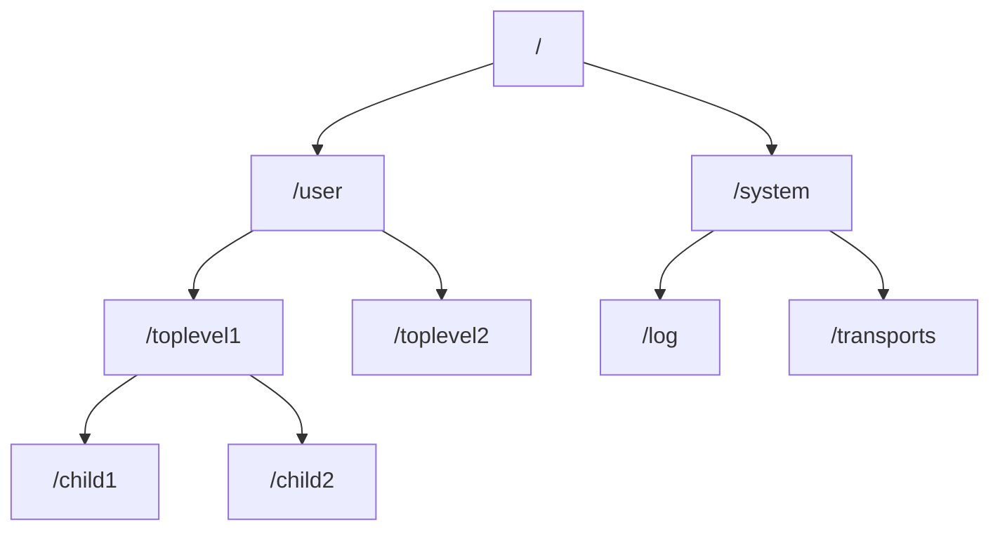
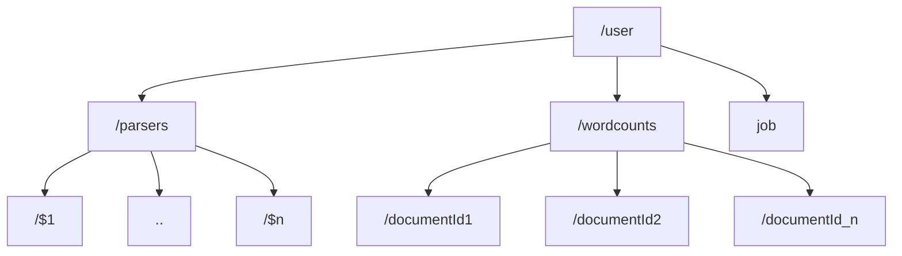

In this lesson, we’re going to build out `AkkaWordCounter2`’s messaging structure and leverage Akka.NET’s actor hierarchy concept to help us separate our programming concerns.

## Actor Hierarchies

Throughout Akka.NET Bootcamp so far, we’ve only looked at “top-level” actors—these are actors we create using the `ActorSystem.ActorOf` method directly:

```cs
.WithActors((system, registry, resolver) => {
    var helloActor = system.ActorOf(Props.Create(() => new HelloActor()), "hello-actor");
})
```

A really important concept used in many actor model implementations is the concept of “child” actors, akin to “child processes” in multi-process programming models. Akka.NET supports this concept, and it is frequently used as a first-class design system for modeling software domains.

<iframe width="560" height="315" src="https://www.youtube.com/embed/Amm7jmTifX8" title="Tutorial: Creating Professional, Local Akka.NET Applications (Bootcamp 2.0 - Unit 1)" frameborder="0" allow="accelerometer; autoplay; clipboard-write; encrypted-media; gyroscope; picture-in-picture; web-share" referrerpolicy="strict-origin-when-cross-origin" allowfullscreen></iframe>
_Starts at the appropriate timestamp for this lesson_

### Top-Level Actors vs. Child Actors

One of the tools we’re going to introduce later in Akka.NET Bootcamp is [Petabridge.Cmd](https://cmd.petabridge.com/)—a free CLI developed by our team here at Petabridge for managing Akka.NET applications.

One of the useful commands that ships in the default `Petabridge.Cmd.Host` package is the [`actor hierarchy` command](https://cmd.petabridge.com/articles/commands/actor-commands.html#actor-hierarchy), which renders a printout of all running actors in a local or remote process.

Let’s run this command on an instance of our [DrawTogether.NET public code sample](https://github.com/petabridge/DrawTogether.NET):

```powershell
pbm actor hierarchy
```

Here is the output:

```powershell
/system
/system/actor-telemetry-subscriber
/system/akka.persistence.journal.sql
/system/akka.persistence.snapshot-store.sql
/system/cluster
/system/cluster/core
/system/cluster/heartbeatReceiver
/system/clusterEventBusListener
/system/deadLetterListener
/system/endpointManager
/system/endpointManager/reliableEndpointWriter-akka.tcp%3A%2F%2FDrawTogether%40drawtogether-1.drawtogether%3A5055-1
/system/endpointManager/reliableEndpointWriter-akka.tcp%3A%2F%2FDrawTogether%40drawtogether-2.drawtogether%3A5055-2
/system/EventStreamUnsubscriber-1
/system/IO-TCP
/system/IO-TCP/$a
/system/log1-LoggerFactoryLogger
/system/monitor-recorder
/system/phobos-cluster-listener
/system/phobos-sharding-listener
/system/recoveryPermitter
/system/remote-deployment-watcher
/system/remote-watcher
/system/remoting-terminator
/system/sharding
/system/sharding/draw-stateReplicator
/system/sharding/drawing-session
/system/sharding/drawing-sessionCoordinator
/system/StreamSupervisor-0
/system/StreamSupervisor-0/l2dbWriteJournal-0-0-unknown-operation
/system/StreamSupervisor-1
/system/transports
/system/transports/akkaprotocolmanager.tcp.0
/user
/user/$a
/user/all-drawings-index
/user/all-drawings-publisher
/user/ddataReplicatorSupervisor
/user/ddataReplicatorSupervisor/ddataReplicator
/user/local-drawing-session
/user/pbm-client-manager
/user/pbm-local-clients
/user/pbm-uptime
/user/petabridge.cmd
/user/petabridge.cmd/127.0.0.1%3A58458
/user/petabridge.cmd-log-memorizer
/user/remote-connection-history
/user/remote-stats   
```

You’ll notice two different root actors here:

- **`/system`** - this is the root of all internal actors Akka.NET uses to run its own infrastructure (i.e., the logging system, remoting, clustering, persistence, and more).
- **`/user`** - this is the root of all user-defined actors.

Your top-level actors are all children of the `/user` actor, ultimately.

And just to give you a rough visual of what an actor hierarchy looks like:

### Why Have Child Actors?

Top-level actors make sense—you can’t do anything without starting at least one actor.

But why create child actors? What are the benefits?

To answer this question, let’s outline some of the behaviors around parent and child actor relationships:

1. **Child actors are non-transferable**—actors always live as children of their parent.
2. **Child actors share a lifecycle with their parent**—child actors can’t be started until their parent starts, and when a parent actor shuts down, it must first terminate all of its children. This applies recursively throughout the actor hierarchy.
3. **Fault tolerance and actor supervision depend on the actor hierarchy**—if an actor throws an unhandled exception, its parent actor determines how to handle it. By default, the actor restarts and resumes message processing afterward.

In general, **child actors should be treated as extensions of the parent’s domain**. One of the powerful ideas Akka.NET allows you to express is the notion of representing each business entity—whether a customer, device, product, order, etc.—as its own actor.

Spreading responsibility across child actors keeps state management simple and programming intuitive. However, we often need a single point of reference for distributing and routing messages belonging to a given class of entity.

This is exactly what actor hierarchies do naturally. We even have a pattern to describe this type of interaction: [the “child-per-entity” pattern](https://petabridge.com/blog/top-akkadotnet-design-patterns/), which we will be using in `AkkaWordCounter2`.

## Modeling `AkkaWordCounter2`’s Actor Hierarchy

Based on our requirements from the beginning of “[Using Akka.Templates to Create New Projects](https://petabridge.com/bootcamp/lessons/unit-1/akka-templates/)” - we know that we’re going to need actors that can do the following things:

1. Parse and extract text from mulitple web pages;
2. Compute a running total of word-frequencies per-page;
3. Manage the total job execution (downloading + parsing + totaling) and deliver a final output back to the console.

This division of labor neatly fits into an actor hiearchy design already - but there will be some subleties we have to address:

1. Parsing is an I/O-bound operation, therefore we are going to want _multiple_ parser actors all running in parallel in order to avoid bottlenecking.
2. Running totals computation for each document should be isolated to their own actor - it’s much simpler and easier to manage the state for a single instance of a thing than it is for an unbounded number of instances.

Given that, here’s the actor types that we’re going to create - assigned by their responsibilities.

- **`ParserActor`** - does all of the I/O bound work. We are going to [use Akka.NET’s “routers” to create a pool](https://getakka.net/articles/actors/routers.html) of these.
- **`WordCounterManager`** - parent of all of the `DocumentWordCounter` actors we’re going to use.
- **`DocumentWordCounter`** - actor responsible for computing the word counts for a single document.
- **`WordCountJobActor`** - the actor responsible for owning the entire “job.” Think of it like a [saga or a process manager](https://petabridge.com/blog/akkadotnet-clusters-sagas/).

How would we represent this as an actor hierarchy?

## Defining Our Messages

As we mentioned in “[Effective Actor Messaging](https://petabridge.com/bootcamp/lessons/unit-0/effective-actor-messaging/)” - our coding and implementation typically begins with designing messages. Because our application is a bit more sophisticated than it was last time, due to handling multiple documents primarily, our messaging design needs to be a tad more robust than in Unit 0.

### Value Objects: `AbsoluteUri`

The first thing we’re going to do is leverage a “value object” to represent our unique identifier for documents inside `AkkaWordCounter2`. We’ve covered the gist of what value objects do before in our video “[Make Illegal States Unrepresentable - N+1 and Arithmetic Errors](https://www.youtube.com/watch?v=GylNVtEK_L8).”

<iframe width="560" height="315" src="https://www.youtube.com/embed/GylNVtEK_L8" title="Make Illegal States Unrepresentable  - N+1 and Arithmetic Errors" frameborder="0" allow="accelerometer; autoplay; clipboard-write; encrypted-media; gyroscope; picture-in-picture; web-share" referrerpolicy="strict-origin-when-cross-origin" allowfullscreen></iframe>

Create a new file called `Messages.cs` and type this into the top of it:

```cs
using System.Collections.Immutable;

namespace AkkaWordCounter2.App;

/// <summary>
/// Value type for enforcing absolute uris
/// </summary>
public record struct AbsoluteUri {
    public AbsoluteUri(Uri value) {
        Value = value;
        if (!value.IsAbsoluteUri) {
            throw new ArgumentException("Value must be an absolute URL", nameof(value));
        }
    }

    public Uri Value { get; }

    public override string ToString() => Value.ToString();
}
```

This `record struct` is there to help guarantee that every document URI we work with is an absolute URI - we’re doing this in order to simplify the work our `HttpClient`s will do in subsequent lessons.

### Using Marker Interfaces for Entity Correlation

A technique we did not explore in “[Effective Actor Messaging](https://petabridge.com/bootcamp/lessons/unit-0/effective-actor-messaging/)” is the use of “marker interfaces” to make it really easy to group messages that all belong to related entities together.

Add this piece of code to `Messages.cs` inside `AkkaWordCounter2.App`:

```cs
public interface IWithDocumentId {
    AbsoluteUri DocumentId { get; }
}
```

The purpose of `IWithDocumentId` is to allow more “generalist” actors, like the `WordCounterManager`, to have a single handler for all messages that implement the `IWithDocumentId` interface - even if new ones are added in future versions of the application.

The message-specific handlers will be implemented in the leaf node actors in our hierarchy - the `DocumentWordCounter` and others.

So next, let’s go ahead and add the following to our `Messages.cs` file:

```cs
public static class DocumentCommands {
    public sealed record ScanDocument(AbsoluteUri DocumentId) : IWithDocumentId;
    public sealed record ScanDocuments(IReadOnlyList<AbsoluteUri> DocumentIds);
}

public static class DocumentEvents {
    public sealed record DocumentScanFailed(AbsoluteUri DocumentId, string Reason) : IWithDocumentId;

    public sealed record WordsFound(AbsoluteUri DocumentId, IReadOnlyList<string> Tokens) : IWithDocumentId;

    public sealed record EndOfDocumentReached(AbsoluteUri DocumentId) : IWithDocumentId;

    public sealed record CountsTabulatedForDocument(AbsoluteUri DocumentId, ImmutableDictionary<string, int> WordFrequencies)
        : IWithDocumentId;

    public sealed record CountsTabulatedForDocuments(
        IReadOnlyList<AbsoluteUri> Documents,
        IImmutableDictionary<string, int> WordFrequencies);
}

public static class DocumentQueries {
    public sealed record FetchCounts(AbsoluteUri DocumentId) : IWithDocumentId;

    public sealed class SubscribeToAllCounts {
        public static readonly SubscribeToAllCounts Instance = new();
        private SubscribeToAllCounts(){}
    }
}
```

We have our original “effects system” we described in “[Effective Actor Messaging](https://petabridge.com/bootcamp/lessons/unit-0/effective-actor-messaging/)” - commands, events, and queries. Most of these message types are self-evident.

The one important nuance is that we have two categories of commands / events / queries:

1. **Messages scoped to a single document** - these all implement `IWithDocumentId`;
2. **Messages scoped to multiple documents** - these messages DO NOT implement `IWithDocumentId` and they’ll all ultimately be handled by the `WordCountJobActor`.

## Wrapping Up

This lesson was already getting pretty long, so we’re going to take a break here before we start implementing some of our actor classes. Continue with our next lesson: “[Behavior-Switching](https://petabridge.com/bootcamp/lessons/unit-1/behavior-switching/).”

### Further Reading

- [What Happens When Akka.NET Actors Restart?](https://petabridge.com/blog/akkadotnet-actors-restart/)
- [Make Illegal States Unrepresentable - N+1 and Arithmetic Errors](https://www.youtube.com/watch?v=GylNVtEK_L8)
- [Meet the Top Akka.NET Design Patterns](https://petabridge.com/blog/top-akkadotnet-design-patterns/)
- [Real World Akka.NET Clustering: Process Managers and Long-Running Operations](https://petabridge.com/blog/akkadotnet-clusters-sagas/)

---

- Previous Lesson: [[1 Using Akka.Templates to Create New Projects]]
- Next Lesson: [[3 Behavior Switching and Receive Timeouts]]