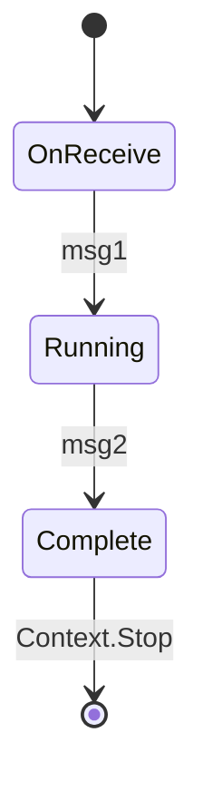
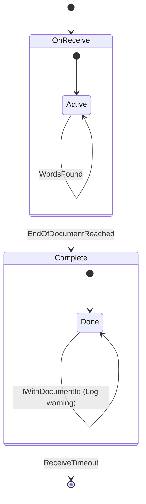
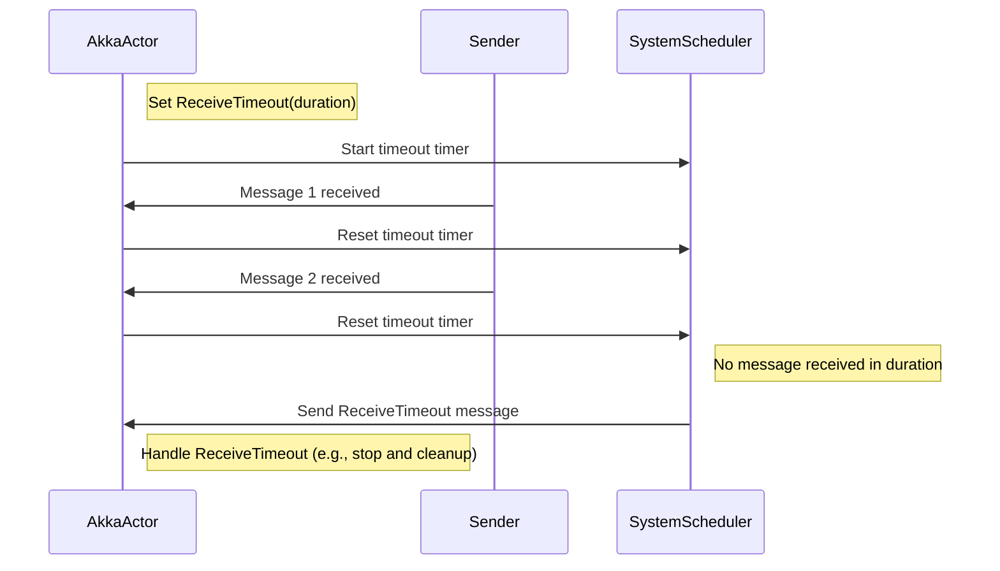

In this lesson, we will explore using Akka.NET actors’ behavior switching and `ReceiveTimeout` capabilities in order to complete the next phase of `AkkaWordCounter2`.

## Finite State Machines

When a developer hears the term “finite state machine” they will think one of three things:

1. What on earth is _that_?
2. An ancient programming concept I learned in college but never used; or
3. Extremely powerful tool for modeling domains in software.

By the end of this lesson, we want everyone to be in category 3.

A finite state machine is a simple yet powerful model that captures the idea of a system with a limited number of states, transitioning between these states in response to external inputs.



With actors, we use _behavior switching_ as our primary tool for modeling state machines. And as a preview - **behavior switching is one of Akka.NET’s most powerful features**.

<iframe width="560" height="315" src="https://www.youtube.com/embed/Amm7jmTifX8" title="Tutorial: Creating Professional, Local Akka.NET Applications (Bootcamp 2.0 - Unit 1)" frameborder="0" allow="accelerometer; autoplay; clipboard-write; encrypted-media; gyroscope; picture-in-picture; web-share" referrerpolicy="strict-origin-when-cross-origin" allowfullscreen></iframe>
_Starts at the appropriate timestamp for this lesson_

### Modeling the `DocumentWordCounter`

The first actor we’re going to implement is the `DocumentWordCounter` - it’s ultimately responsible for totaling all of the word frequencies that appear on a single document.

Therefore, we have a few implicit requirements with this actor:

1. There is a definitive beginning and end to this actor’s workflow - once we receive the `DocumentEvents.EndOfDocumentReached` message, _we are done_.
2. If we receive any more `DocumentEvents.WordsFound` after receiving the `DocumentEvents.EndOfDocumentReached` then it was sent in error.
3. If we receive a `DocumentQueries.FetchCounts` message before we’re done tabulating the results, we need to wait until we’ve fully processed every `DocumentEvents.WordsFound` message until we’re ready to respond.

All of these requirements can be easily addressed with a state machine.



## Implementing the `DocumentWordCounter`

Our state machine diagram above may not make total sense until we look at the code, so let’s do that next.

Create a new folder called `Actors` in `AkkaWordCounter2.App` - and then add a new file called `DocumentWordCounter.cs` to it. The full path should be `AkkaWordCounter2.App/Actors/DocumentWordCounter.cs`.

Enter the following code into the file:

```cs
using System.Collections.Immutable;
using static AkkaWordCounter2.App.DocumentEvents;
using static AkkaWordCounter2.App.DocumentQueries;
namespace AkkaWordCounter2.App.Actors;

public sealed class DocumentWordCounter : UntypedActor {
    private readonly AbsoluteUri _documentId;
    private readonly ILoggingAdapter _log = Context.GetLogger();
    
    private readonly Dictionary<string, int> _wordCounts = new();
    private readonly HashSet<IActorRef> _subscribers = new();

    public DocumentWordCounter(AbsoluteUri documentId) {
        _documentId = documentId;
    }
    
    // Our default behavior when we're running
    protected override void OnReceive(object message) {
        switch (message) {
            case WordsFound wordsFound when wordsFound.DocumentId == _documentId:
                _log.Debug("Found {0} words in document {1}", wordsFound.Tokens.Count, _documentId);
                foreach (var word in wordsFound.Tokens) {
                    if (!_wordCounts.TryAdd(word, 1)) {
                        _wordCounts[word]++;
                    }
                }
                break;
            case FetchCounts subscribe when subscribe.DocumentId == _documentId:
                _subscribers.Add(Sender);
                break;
            case EndOfDocumentReached endOfDocumentReached when endOfDocumentReached.DocumentId == _documentId:
                var output = new CountsTabulatedForDocument(_documentId, _wordCounts.ToImmutableDictionary(x => x.Key, x => x.Value));
                foreach (var subscriber in _subscribers) {
                    subscriber.Tell(output);
                }
                _subscribers.Clear();
                
                // processing is done - change behaviors
                Become(Complete);
                break;
            case IWithDocumentId withDocumentId when withDocumentId.DocumentId != _documentId:
                _log.Warning("Received message for document {0} but I am responsible for document {1}", withDocumentId.DocumentId, _documentId);
                break;
            case ReceiveTimeout:
                _log.Warning("Document {0} timed out", _documentId);
                Context.Stop(Self);
                break;
            default:
                Unhandled(message);
                break;
        }
    }

    private void Complete(object message) {
        switch (message) {
            case FetchCounts:
                Sender.Tell(new CountsTabulatedForDocument(_documentId, _wordCounts.ToImmutableDictionary(x => x.Key, x => x.Value)));
                break;
            case IWithDocumentId withDocumentId when withDocumentId.DocumentId == _documentId:
                _log.Warning("Received message for document {0} but I have already completed processing", withDocumentId.DocumentId);
                break;
            case IWithDocumentId withDocumentId when withDocumentId.DocumentId != _documentId:
                _log.Warning("Received message for document {0} but I am responsible for document {1}", withDocumentId.DocumentId, _documentId);
                break;
            case ReceiveTimeout:
                // no need for warning here
                Context.Stop(Self);
                break;
            default:
                Unhandled(message);
                break;
        }
    }

    protected override void PreStart() {
        SetReceiveTimeout(TimeSpan.FromMinutes(2));
    }
}
```

Let’s walk through what we just did - we have two different behaviors for this actor: `OnReceive`, our default behavior on all `UntypedActor`s, and `Complete`.

### Switching Behaviors

In the `OnReceive` behavior we’re accepting `WordsFound` events provided that the `AbsoluteUri` of the document matches the `AbsoluteUri` that was passed into the `DocumentWordCounter`’s constructor - otherwise we log a warning. For each `WordsFound` event we populate our `Dictionary<string,int>` with updated values.

That’s 90% of what we do in this behavior - the other two things we’re doing are:

1. If an actor sends us a `FetchCounts` message with a matching URI, we can’t reply to them until we receive the `EndOfDocumentReached` message because we’re still tabulating. So we just stick the actor who sent us that message into the `DocumentWordCounter`’s `_subscribers` collection until we’re ready.
2. Once we receive the `EndOfDocumentReached` then we are done tabulating! We send an immutable copy of our running totals to all of our subscribers and then here’s the important part - we call `Become(Completed)` to transition our behavior over to the `Completed` state.

We have a great blog post and video on “[Akka.NET Actors’ Hidden Super Power: Behavior Switching](https://petabridge.com/blog/akka-actor-behavior-switching/)” that goes into full detail on behavior switching and its utility, but we’ll do the short version below.

<iframe width="560" height="315" src="https://www.youtube.com/embed/FaFlpQgTivU" title="Akka.NET Actors&#39; Hidden Super Power: Switchable Behaviors" frameborder="0" allow="accelerometer; autoplay; clipboard-write; encrypted-media; gyroscope; picture-in-picture; web-share" referrerpolicy="strict-origin-when-cross-origin" allowfullscreen></iframe>

When you call `Become({new behavior method})` you are telling the actor: stop using your previous behavior and _only_ start using this new one. This means we discard all previous message handlers and use only those defined in the `Complete` method.

Generally, in the `Complete` behavior all we’re doing is replying back to queries and logging warnings for any other messages we might receive. One notable exception to this, however, is the `ReceiveTimeout`.

## `ReceiveTimeout` for Terminating Idle Actors

By default, actors in Akka.NET live indefinitely - there’s no magic garbage collector running around trying to guess which actors are in-use and which ones are not. This aligns with the framework’s unopinionated design philosophy.

Therefore, if you’re going to be spawning lots of child actors on-demand you want some means of keeping memory consumption under control.

Enter the `ReceiveTimeout` - a very simple construct built into the Akka.NET core library that is designed to function as a “sliding window” timeout. Each time an actor receives a message[^1] its “receive timeout” window is restored back to its original full value.



In this particular instance, you can see us setting a 2-minute receive timeout inside the `PreStart` method of the `DocumentWordCounter` actor:

```cs
protected override void PreStart() {
    SetReceiveTimeout(TimeSpan.FromMinutes(2));
}
```

Once we go two minutes without receiving any messages the Akka.NET scheduler will send us a `ReceiveTimeout` message:

```cs
case ReceiveTimeout:
    // no need for warning here
    Context.Stop(Self);
    break;
```

In that particular instance, inside the `Complete` state, we just shut ourselves down via `Context.Stop` as the actor is probably no longer needed any longer.

## Wrapping Up

That’s it for this lesson! In the next lesson we are going to use the Akka.TestKit to author some unit tests for our `DocumentWordCounter`.

### Further Reading

- [Akka.NET Actors’ Hidden Super Power: Behavior Switching](https://petabridge.com/blog/akka-actor-behavior-switching/)
- [Building Finite State Machines With Actors: Switchable Behavior](https://petabridge.com/blog/akka-actors-finite-state-machines-switchable-behavior/)

[^1]: You can design messages that don’t affect `ReceiveTimeout`s by having those messages implement the [`INotInfluenceReceiveTimeout` interface](https://getakka.net/api/Akka.Actor.INotInfluenceReceiveTimeout.html). [↩](https://petabridge.com/bootcamp/lessons/unit-1/behavior-switching/#fnref:1)

---

- Previous Lesson: [[2 Actor Hierarchies and Domain Modeling]]
- Next Lesson: [[4 Testing Actors with Akka.TestKit]]