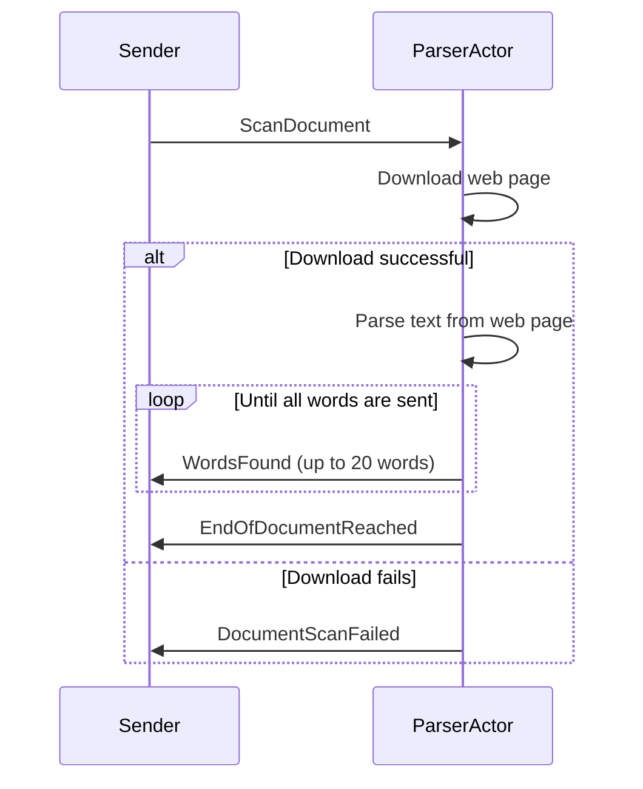

In this unit, we’re going to build some actors that leverage the `ReceiveActor` and `UntypedActor`’s simple syntax for working with `async` and `await` for handling `Task`s executed during the course of actor message processing.

## The `ParserActor`

We’re going to create a new actor type, the `ParserActor` is responsible for the following:



<iframe width="560" height="315" src="https://www.youtube.com/embed/Amm7jmTifX8" title="Tutorial: Creating Professional, Local Akka.NET Applications (Bootcamp 2.0 - Unit 1)" frameborder="0" allow="accelerometer; autoplay; clipboard-write; encrypted-media; gyroscope; picture-in-picture; web-share" referrerpolicy="strict-origin-when-cross-origin" allowfullscreen></iframe>
_Starts at the appropriate timestamp for this lesson_

### Installing `HtmlAgilityPack` and Other Dependencies

Before implementing the message types and the actor, we must add dependencies to our `AkkaWordCounter2.App` project:

```powershell
dotnet add package HtmlAgilityPack
dotnet add package Microsoft.Extensions.Http
```

1. The [`HtmlAgilityPack` package](https://www.nuget.org/packages/HtmlAgilityPack) is a widely used XPath parser for working with the DOM inside HTML files. We’re going to use this for extracting text from web pages.
2. [`Microsoft.Extensions.Http`](https://www.nuget.org/packages/Microsoft.Extensions.Http) is a package that gives us access to the `IHttpClientFactory`, which makes it simple to use a pool of `HttpClient` instances across many different requests. In sum, it simplifies the lifetime management of `HttpClient` instances.

### Utility Classes

After installing both of these, create a new file named `TextExtractor.cs` and type this into it:

```cs
using HtmlAgilityPack;

namespace AkkaWordCounter2.App;

public static class TextExtractor
{
    /// <summary>
    /// Extracts raw text from a HtmlDocument
    /// </summary>
    /// <remarks>
    /// Shouldn't pick up stuff from script / style tags etc
    /// </remarks>
    public static IEnumerable<string> ExtractText(HtmlDocument htmlDocument)
    {
        var root = htmlDocument.DocumentNode;
        foreach (var node in root.Descendants()
                     .Where(n => n.NodeType == HtmlNodeType.Text &&
                            n.ParentNode.Name != "script" &&
                            n.ParentNode.Name != "style"))
        {
            string text = node.InnerText.Trim();
            if (!string.IsNullOrEmpty(text))
                yield return text;
        }
    }
    
    public static IEnumerable<string> ExtractTokens(string text)
    {
        var tokens = text.Split([' ', '\n', '\r', '\t'], StringSplitOptions.RemoveEmptyEntries);
        foreach (var token in tokens)
        {
            yield return token.Trim();
        }
    }
}
```

This code leverages `HtmlAgilityPack` to extract text from common elements like `div`, `p`, `span`, `a`, `li`, and more. The second method, `ExtractTokens`, splits the `innerText` from these HTML elements into individual words, removing any whitespace.

### Actor Implementation

With all of our dependencies installed and helper functions defined, we are ready to implement the `ParserActor` itself.

Please create a new file inside the `AkkaWordCounter2.App/Actors/` folder called `ParserActor.cs`.

Inside this file type out the following:

```cs
using HtmlAgilityPack;
using static AkkaWordCounter2.App.DocumentCommands;
using static AkkaWordCounter2.App.DocumentEvents;

namespace AkkaWordCounter2.App.Actors;

public sealed class ParserActor : UntypedActor
{
    public const int ChunkSize = 20;
    private readonly ILoggingAdapter _log = Context.GetLogger();
    private readonly IHttpClientFactory _httpClientFactory;
    private readonly CancellationTokenSource _shutdownCts = new();

    public ParserActor(IHttpClientFactory httpClientFactory)
    {
        _httpClientFactory = httpClientFactory;
    }

    protected override void OnReceive(object message)
    {
        switch (message)
        {
            case ScanDocument document:
            {
                RunTask(async () =>
                {
                    try
                    {
                        var textFeatures = await HandleDocument(document.DocumentId);
                        foreach(var f in textFeatures)
                        {
                            Sender.Tell(new WordsFound(document.DocumentId, f));
                        }
                        Sender.Tell(new EndOfDocumentReached(document.DocumentId));
                    }
                    catch(Exception ex)
                    {
                        _log.Error(ex, "Error processing document {0}", document.DocumentId);
                        Sender.Tell(new DocumentScanFailed(document.DocumentId, ex.Message));
                    }
                });
                break;
            }
        }
    }

    protected override void PostStop()
    {
        // shut down any in-flight requests
        _shutdownCts.Cancel();
    }

    private async Task<IEnumerable<string[]>> HandleDocument(AbsoluteUri uri)
    {
        using var requestToken = new CancellationTokenSource(TimeSpan.FromSeconds(5));
        using var linkedToken = CancellationTokenSource
            .CreateLinkedTokenSource(requestToken.Token, 
                _shutdownCts.Token);
        
        using var client = _httpClientFactory.CreateClient();
        var response = await client.GetAsync(uri.Value, linkedToken.Token);
        var content = await response.Content.ReadAsStringAsync(linkedToken.Token);
        var document = new HtmlDocument();
        document.LoadHtml(content);

        // extract all text features
        var text = TextExtractor.ExtractText(document);
        return text.SelectMany(TextExtractor.ExtractTokens).Chunk(ChunkSize);
    }
}
```

## Working with `Task`s Inside Actors

The guts of the `ParserActor` are pretty simple - we only accept one message type: `DocumentCommands.ScanDocument`.

Upon receiving this command, we perform asynchronous I/O using `HttpClient`. In this case, we `await` the `Task` returned by the operation.

Normally an actor’s receive method must return a `void` - [`async void` methods are evil](https://sergeyteplyakov.github.io/Blog/csharp/2025/01/28/The_Dangers_Of_Async_Void.html), so if we want to `await` inside an actor we just need to call `RunTask<T>(Func<Task<T>> fn)`[^1] first.

```cs
RunTask(async () =>
{
    try
    {
        var textFeatures = await HandleDocument(document.DocumentId);
        foreach(var f in textFeatures)
        {
            Sender.Tell(new WordsFound(document.DocumentId, f));
        }
        Sender.Tell(new EndOfDocumentReached(document.DocumentId));
    }
    catch(Exception ex)
    {
        _log.Error(ex, "Error processing document {0}", document.DocumentId);
        Sender.Tell(new DocumentScanFailed(document.DocumentId, ex.Message));
    }
});
```

`RunTask` delivers the continuation `Task` (all code after each `await`) to the actor in question as an internal `/system` message - that way all work is still marshalled through the actor’s mailbox.

While the actor is `await`-ing on a `Task` to complete, it suspends processing on any new `/user` messages. This behavior ensures that the actor’s message-processing behavior is fully consistent whether it’s doing simple synchronous functions or long-running asynchronous functions.

### Alternative to `await`: `PipeTo<T>`

For this sample we went with `await` because it’s easier to reason about error-handling with asynchronous work with it.

However: `await` does come with a significant flow control penalty as it prevents actors from performing work on other messages while the asynchronous `Task` is running. This is a _feature_ of how `await` operates, not a bug.

In situations where it’s desirable to allow an actor to interleave messages - i.e. continue working while a `Task` it spawned executes outside the actor’s context - then we have a solution for that too: [the `PipeTo<T>` extension method](https://getakka.net/api/Akka.Actor.PipeToSupport.html).

Here’s an example of `PipeTo<T>` being used for concurrent HTTP crawling inside [https://github.com/Aaronontheweb/link-validator](https://github.com/Aaronontheweb/link-validator) - an Akka.NET-powered CLI for doing bad link detection inside CI/CD pipelines for websites:

```cs
private void HandleCrawlUrl(CrawlUrl msg)
{
    /*
     * We will not receive a CrawlUrl message from the IndexerActor if we've
     * already seen this page before.
     */
    _inflightRequests++;

    DoWork().PipeTo(Self, Self, result => result);
    return;

    async Task<PageCrawled> DoWork()
    {
        // async I/O code
    }
}
```

What `PipeTo` does: it takes the output of a `Task` and delivers it to an actor’s mailbox via an `IActorRef.Tell`. The key performance benefit of it is that it’s non-blocking, so one actor can execute multiple `Task`s and process messages while they’re all running concurrently.

We put together a detailed blog post and YouTube video on this subject a couple of years ago: [“Async / Await vs. PipeTo in Akka.NET Actors](https://petabridge.com/blog/async-await-vs-pipeto/).”

<iframe width="560" height="315" src="https://www.youtube.com/embed/Tx4WyLbsMc0" title="Akka.NET Actors: Async / Await vs PipeTo" frameborder="0" allow="accelerometer; autoplay; clipboard-write; encrypted-media; gyroscope; picture-in-picture; web-share" referrerpolicy="strict-origin-when-cross-origin" allowfullscreen></iframe>
## Wrapping Up

We implemented our `ParserActor` and learned about working with `Task`s inside actors - [in the next lesson we’re going to learn how to leverage routers to increase parallelism with our actors AND how to use Akka.Hosting and Akka.DependencyInjection](https://petabridge.com/bootcamp/lessons/unit-1/akka-hosting/).

### Further Reading

- [Async / Await vs. PipeTo in Akka.NET Actors](https://petabridge.com/blog/async-await-vs-pipeto/)

[^1]: A `ReceiveActor`’s `ReceiveAsync<T>` uses `RunTask<T>` internally. [↩](https://petabridge.com/bootcamp/lessons/unit-1/async-await-actors/#fnref:1)

---

- Previous Lesson: [[5 Working with Child Actors]]
- Next Lesson: [[7 Akka.Hosting, Routers, and Dependency Injection]]